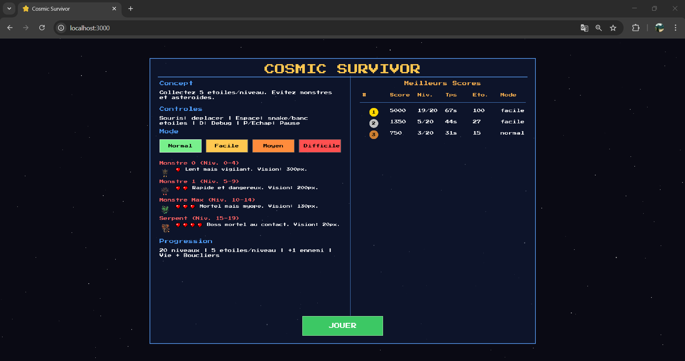
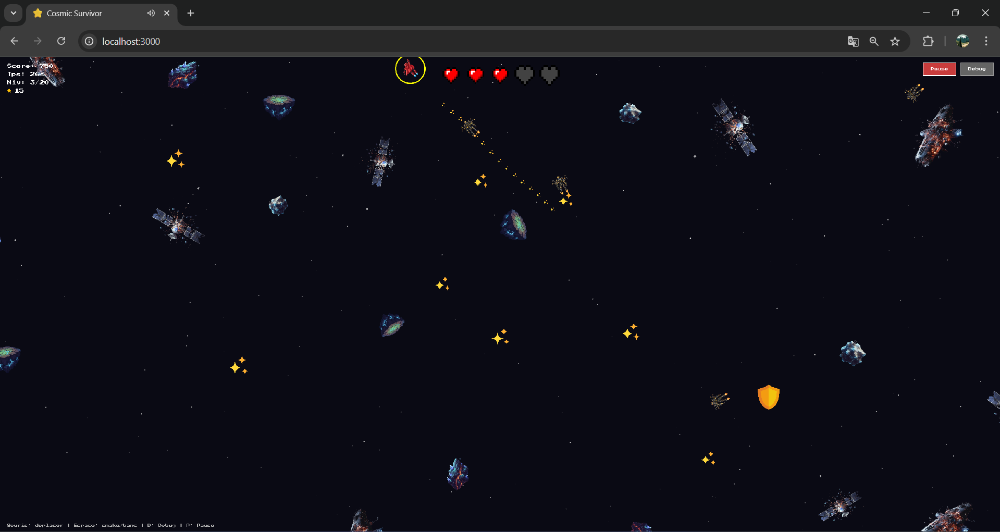
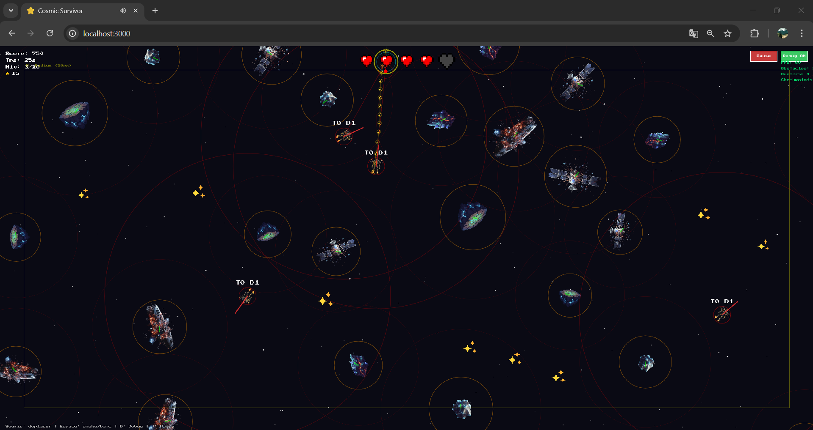
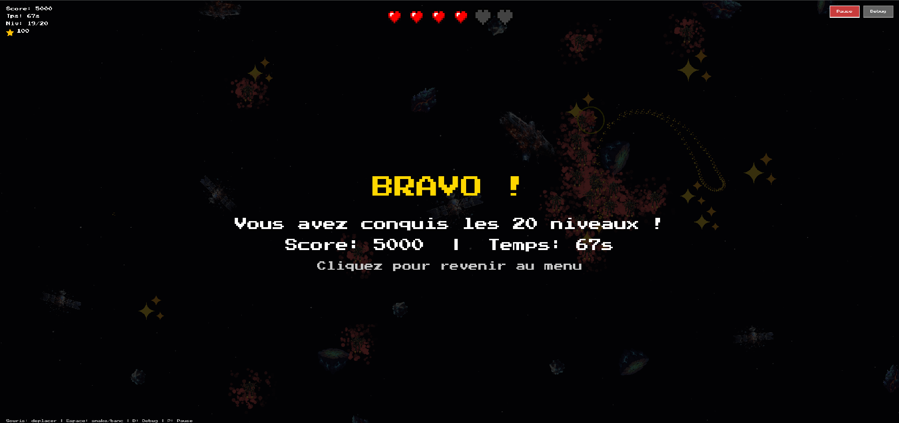

# Cosmic Survivor

## Captures d’écran (affichage)

### Page d’accueil (Rampage)

Écran principal au lancement du jeu : choix du **mode** (Normal, Facile, Moyen, Difficile), description des monstres selon le mode, tableau des **meilleurs scores** avec la colonne Mode, et bouton **JOUER** / **REPRENDRE** pour lancer ou reprendre une partie.

---

### Écran de jeu (Game)

En partie : le joueur se déplace à la souris, collecte les **étoiles** (checkpoints) pour avancer ; les étoiles collectées le suivent (snake ou banc, touche **Espace**). Il évite les **monstres** (poursuite / wander) et les **obstacles** mobiles. En haut : barre de cœurs centrée ; en haut à gauche : score, temps, niveau, étoiles. Le déplacement et l’IA utilisent uniquement les **comportements de steering** (arrive, pursue, wander, avoidObstacles, separate, boundaries).

---

### Écran de jeu en mode Debug

Même écran avec le **mode Debug** activé (touche **D** ou bouton Debug). Permet de visualiser les éléments techniques du cours :

| Élément | Description |
|--------|-------------|
| **Rectangle jaune** | Zone des **boundaries** (marge 50 px) : force de répulsion près des bords. |
| **FPS + compteurs** | En haut à droite : FPS, nombre d’obstacles, de chasseurs, de checkpoints. |
| **Joueur** | Cercle cyan (collision), point rouge = **tête** (zone de dégâts), vecteur vélocité (cyan), ligne vers la souris (cible **arrive**), segments des **étoiles** qui suivent (snake ou banc). |
| **Monstres** | Cercle rouge = **rayon de perception** (pursue si joueur dedans, sinon wander), cercle de collision, vecteur vélocité, ligne vers le joueur quand en poursuite. Label type/dégâts (T0 D1, etc.). |
| **Obstacles** | Cercle orange (collision), vecteur vélocité (vert), cercle rouge léger = zone de **séparation**. |

Le mode Debug illustre concrètement les comportements de steering (arrive, pursue, wander, separate, boundaries) et les zones de détection.

---

### Écran Victoire (Bravo !)

Après avoir conquis les **20 niveaux** : message **« BRAVO ! »**, récapitulatif (score, temps), et invitation à cliquer pour revenir au menu. La barre de cœurs reste affichée en haut au centre, le score/temps en haut à gauche.

---

## Objectif du projet (conformité au cours)

Ce projet a pour but premier de **respecter les consignes du cours** et d’appliquer les **concepts de comportements de steering (Craig Reynolds)** vus dans les projets 1 à 10. Le jeu est un support pour illustrer ces concepts : toutes les entités (joueur, monstres, obstacles, segments d’étoiles) sont des **sous-classes de `Vehicle`** et utilisent uniquement les **méthodes de steering** définies dans la classe de base **sans jamais modifier `vehicle.js`**.

---

## Concept du jeu

**Cosmic Survivor** est un jeu de survie spatial en vue du dessus (top-down) développé avec **p5.js**. Le joueur contrôle un personnage dans l’espace, collecte des étoiles pour progresser à travers **20 niveaux**, évite des monstres et navigue parmi des obstacles mobiles. Le déplacement et l’IA reposent entièrement sur les **comportements de steering** : seek, flee, arrive, pursue, wander, avoidObstacles, separate, boundaries.

---

## Comment jouer

| Contrôle | Action |
|----------|--------|
| **Souris** | Déplacer le personnage (comportement `arrive` vers la souris) |
| **Espace** | Changer le comportement des étoiles qui vous suivent : **snake** (chaîne) ou **banc** (groupe) |
| **D** | Activer / désactiver le mode Debug |
| **P / Échap** | Pause — retour au menu ; clic sur « Reprendre » pour continuer (compte à rebours 3-2-1) |
| **Menu** | Choisir un **mode** (Normal, Facile, Moyen, Difficile), puis cliquer **JOUER** pour valider et lancer la partie |

---

## Modes de jeu

Le mode est choisi au menu (4 boutons) et validé en cliquant sur **JOUER**. Les monstres et niveaux dépendent du mode.

| Mode | Niveaux | Monstres |
|------|---------|----------|
| **Normal** | 0-4 | Monstre 0 (1 cœur, vision 300 px) |
| | 5-9 | Monstre 1 (2 cœurs, vision 200 px) |
| | 10-14 | Monstre Max (3 cœurs, vision 130 px) |
| | 15-19 | Serpent boss (4 cœurs, vision 20 px) |
| **Facile** | 1-20 | Uniquement Monstre 0 (1 cœur) |
| **Moyen** | 1-10 | Monstre 1 (2 cœurs) |
| | 11-20 | Monstre Max (3 cœurs) |
| **Difficile** | 1-10 | Monstre Max (3 cœurs) |
| | 11-20 | Serpent (4 cœurs) |

Le **tableau des meilleurs scores** affiche une colonne **Mode** pour chaque partie (Normal, Facile, Moyen, Difficile), afin de comparer les scores dans le même mode.

---

## Système de vies (cœurs)

- **Départ** : **5 cœurs pleins** (affichés dans la **barre centrée en haut** uniquement).
- **Perte d’une vie** : un cœur passe en **noir** (cœur mort) dans la barre ; il reste affiché, seul l’état change.
- **Bonus** : en ramassant un **cœur** (collectable) alors que toutes les vies sont pleines, on peut gagner **1 ou 2 cœurs permanents** en plus (6e puis 7e). Au-delà de **7 cœurs** au total, on ne peut plus en ramasser.
- **Niveau suivant** : toutes les vies sont restaurées (jusqu’à `maxLives`).
- **Étoiles qui suivent** : **Espace** alterne le mode **snake** (chaîne avec `arrive`) ou **banc** (separate + align + cohesion + arrive) — Règle 5.

---

## Fonctionnalités actuelles

- **Page d’accueil** : concept, contrôles (Souris, **Espace** snake/banc, D, P), **4 boutons de mode** (Normal, Facile, Moyen, Difficile) avec thème couleur, **description des monstres** (icônes, cœurs, niveaux) selon le mode choisi, progression (20 niveaux, 5 étoiles/niveau), **tableau des meilleurs scores** avec colonne **Mode**, bouton **JOUER** / **REPRENDRE**. Style **pixel** (police type rétro, boutons à bords droits).
- **Pause** : P ou Échap → retour au menu ; **REPRENDRE** avec compte à rebours 3-2-1.
- **20 niveaux** (0 à 19) : 5 étoiles par niveau pour passer au suivant ; un nouvel ennemi apparaît à chaque niveau (selon le mode).
- **5 cœurs par défaut, 7 max** : barre centrée en haut ; cœurs perdus restent en noir. **Espace** : alterner snake / banc pour les étoiles qui suivent.
- **Dégâts à la tête uniquement** : contact avec la pointe avant du joueur ; invulnérabilité temporaire après coup (clignotement).
- **Collectables** : cœurs (soin ou +1 cœur permanent si déjà pleins, max 7) et boucliers (invulnérabilité temporaire).
- **Obstacles mobiles** : astéroïdes avec `wander`, `separate`, `flee` (étoiles), wrap-around.
- **Sons (style rétro)** : ramassage cœur/bouclier, dégâts (selon type de monstre), passage de niveau, victoire, game over ; **musique de fond** en jeu : thème doux, aventureux et encourageant (mélodie en boucle avec légère basse), qui accompagne toute la partie.
- **Écrans** : Level Up (NIVEAU X), Victoire (BRAVO !), Game Over ; police pixel sur tous les écrans.
- **Mode Debug** : cercles de collision, rayons de perception, vecteurs, boundaries, FPS, chaîne des cœurs.

---

## Système de niveaux et monstres (mode Normal)

| Niveaux | Monstre | Dégâts | Vision | Vitesse max | Force max |
|---------|---------|--------|--------|-------------|-----------|
| 0-4 | Monster 0 | 1 cœur | 300 px | 4.5 | 0.20 |
| 5-9 | Monster 1 | 2 cœurs | 200 px | 5.0 | 0.28 |
| 10-14 | Monster Max | 3 cœurs | 130 px | 5.5 | 0.35 |
| 15-19 | Serpent (boss) | 4 cœurs | 20 px | 6.0 | 0.40 |

**Équilibre** : plus un monstre fait de dégâts, plus son rayon de vision est petit.

**Comportement des monstres** : dans le rayon de vision → `pursue` (joueur) ; hors vision → `wander` ; toujours → `avoidObstacles`, `separate`, `boundaries`.

---

## Respect des consignes du cours et règles (rules.md)

Le fichier **`rules.md`** (à la racine du projet, dans `CosmicSurvivor/`) définit les consignes à respecter. Résumé :

- **Règle 1 — Base :** **`vehicle.js` n’est jamais modifié.** Il contient la classe `Vehicle` et toutes les méthodes de steering (seek, flee, arrive, pursue, evade, wander, avoidObstacles, separate, boundaries, edges).
- **Règle 2 — Sous-classes :** Toutes les entités sont des **sous-classes** dans `vehicles/` : `PlayerVehicle`, `HunterVehicle`, `ObstacleVehicle`. Chacune surcharge `applyBehaviors(world)`, `show()`, `update()`.
- **Règle 3 — Forces composables :** Chaque comportement **retourne** un vecteur force (il ne l’applique pas). Dans `applyBehaviors(world)` : appeler les comportements, multiplier chaque force par un **poids**, sommer, puis appliquer une seule fois avec `applyForce()`. Les forces sont bornées par `maxForce` et `maxSpeed`.
- **Règle 7 — Architecture :** `sketch.js` = entrée principale (preload, setup, draw, UI, `Particle`, `Collectable`). États de jeu : `"menu"`, `"countdown"`, `"playing"`, `"gameover"`, `"levelup"`, `"victory"`. L’objet **`world`** (player, hunters, obstacles, checkpoints, allVehicles, debugMode) est passé à tous les `applyBehaviors(world)`.

Les règles complètes (assets, style, tableau des comportements) sont dans **`rules.md`** : à respecter pour tout ajout ou modification.

---

## Partie technique

### Fichiers du projet

| Fichier | Rôle |
|---------|------|
| `vehicle.js` | Classe `Vehicle` de base (**non modifiée**) — seek, flee, arrive, pursue, evade, wander, avoidObstacles, separate, boundaries |
| `vehicles/playerVehicle.js` | `HeartSegment` (chaîne avec `arrive`), `PlayerVehicle` (arrive souris/étoile, avoidObstacles, separate, boundaries) |
| `vehicles/hunterVehicle.js` | `HunterVehicle` — pursue / wander, avoidObstacles, separate, boundaries |
| `vehicles/obstacleVehicle.js` | `ObstacleVehicle` — wander, separate, flee (étoiles), wrapAround |
| `checkpoint.js` | `Checkpoint` — étoiles collectables |
| `sketch.js` | Gameloop, états, menu, UI, sons, particules, `Collectable`, `Particle` |
| `index.html` | Page HTML, chargement p5.js et scripts |
| `style.css` | Plein écran, police pixel (Press Start 2P) |

### Mapping des comportements par entité (concepts du cours)

| Entité | Comportements de steering utilisés |
|--------|-----------------------------------|
| **PlayerVehicle** | `arrive` (souris), `arrive` (étoile proche), `avoidObstacles`, `separate`, `boundaries` |
| **StarSegment** | `arrive` (snake) ou `separate` + `arrive` (cohesion) + align (banc / Projet 7) |
| **HunterVehicle** | `pursue` (joueur en vue), `wander` (hors vue), `avoidObstacles`, `separate`, `boundaries` |
| **ObstacleVehicle** | `wander`, `separate`, `flee` (étoiles), wrap-around (hors steering) |

### Détail des comportements (référence cours)

- **Arrive** : vitesse désirée réduite dans un rayon de ralentissement ; utilisé pour le joueur (souris) et la chaîne de cœurs (follow-the-leader).
- **Seek / Flee** : force vers/contre une cible à pleine vitesse ; flee utilisé par les obstacles pour éviter les étoiles.
- **Pursue** : seek vers la position future de la cible (prédiction) ; utilisé par les monstres pour intercepter le joueur.
- **Wander** : cercle projeté devant le véhicule, angle aléatoire ; utilisé par monstres (hors vue) et obstacles.
- **AvoidObstacles** : détection d’obstacle devant, force d’évitement ; joueur et monstres.
- **Separate** : répulsion proportionnelle à l’inverse de la distance entre voisins ; joueur, monstres, obstacles.
- **Boundaries** : force de répulsion dans une marge (50 px) autour de l’écran ; joueur et monstres.

---

## Résumé

Cosmic Survivor applique les **comportements de steering de Craig Reynolds** dans un jeu de survie spatial : joueur, monstres, obstacles et chaîne de cœurs sont tous des **véhicules** dont le mouvement est entièrement piloté par des **forces composables** issues de la classe de base. Le fichier **`vehicle.js`** reste inchangé ; toutes les extensions passent par des **sous-classes** et le respect strict de **`rules.md`**.
